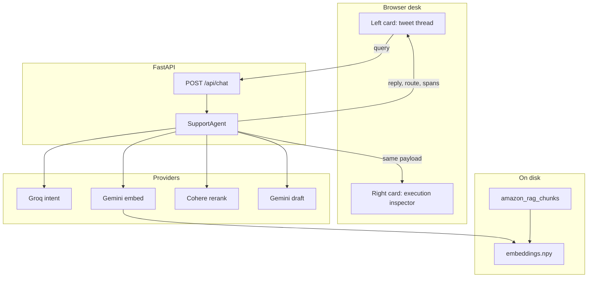
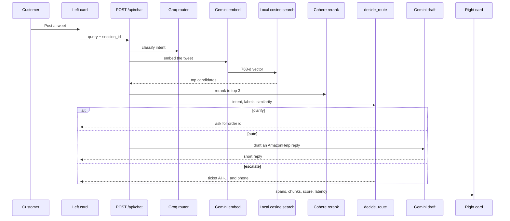
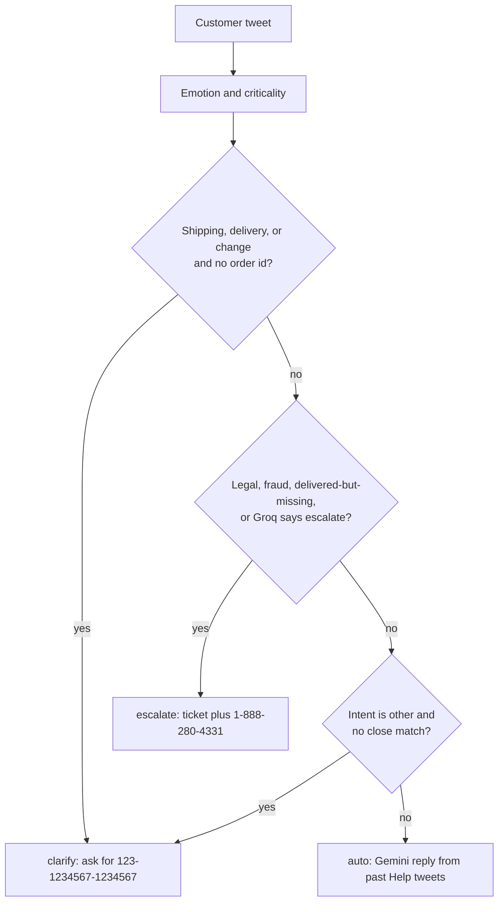
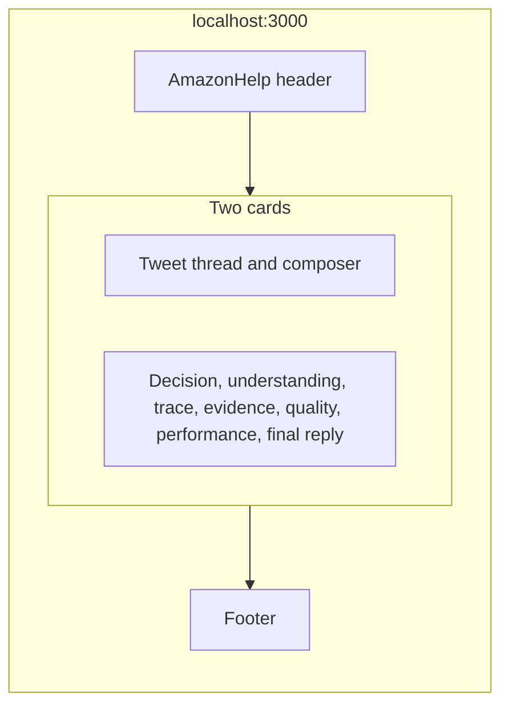
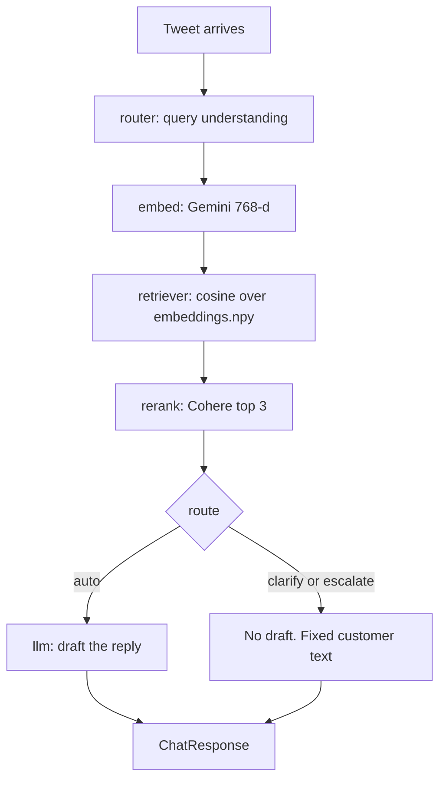
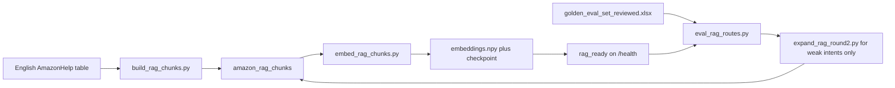

# AmazonHelp

A customer posts like a tweet. Amazon Help either answers from past AmazonHelp replies, asks for an order id, or opens a support ticket. The same page shows how that decision was made.

The left card is the customer thread. The right card is the execution inspector (intent, emotion, criticality, route, trace, sources, score, latency). Customers and operators share this desk on purpose. `/support` and `/admin` both redirect to `/`.

## Architecture

One tweet moves through intent, retrieval, a route decision, then a customer-facing reply. Every step is recorded as a span. The right card reads those spans. It does not show hidden model reasoning.



### Request flow



### Route decision

Rules are in `backend/services/amazon_labels.py`.



| Route | When |
| --- | --- |
| clarify | Shipping, delivery, or a change request with no order id like `123-1234567-1234567` |
| auto | A grounded reply is enough |
| escalate | Delivered-but-missing, fraud, legal, or another case that needs a person. Ticket id `AH-…` and phone `1-888-280-4331` |

### What the page shows



`/support` and `/admin` redirect to `/`. The thread lives in React state for this browser tab. A new tab starts empty.

### Execution trace

Each box is one `@observe_span` in `backend/core/telemetry.py`. The inspector lists only the spans that actually ran.



### Data pipeline



Do not embed the full clean table. Gemini's free embed tier is 1,000 requests a day, so the live `.npy` can be a partial slice until `embed_rag_chunks.py` is resumed.

## Repository

```text
backend/
  main.py                         GET /health
  routers/chat.py                 POST /api/chat
  routers/traces.py               GET /api/traces
  services/agent.py               orchestrator and span methods
  services/amazon_labels.py       intent, emotion, route
  services/intent_router.py       Groq classifier
  services/retriever.py           local vectors, else small policy fallback
  services/rag_local.py           load parquet + embeddings.npy
  services/reranker.py            Cohere
  services/evaluator.py           score and flag
  services/providers/             groq, gemini, cohere clients
  core/telemetry.py               @observe_span
  core/config.py                  env settings
  models/schemas.py               ChatRequest / ChatResponse
frontend/
  app/page.tsx                    desk
  app/support/page.tsx            redirect to /
  app/admin/page.tsx              redirect to /
  components/Desk.tsx             two cards
  components/customer/            thread and composer
  components/ObservabilityPanel.tsx
  lib/case.tsx                    session, posts, latest trace
  lib/api.ts                      /health and /api/chat
scripts/
  build_rag_chunks.py
  embed_rag_chunks.py             resume from checkpoint
  eval_rag_routes.py
  expand_rag_round2.py
  smoke_rag.py
data/eda_results/                 clean table, chunks, embeddings.npy
data/eval/                        golden set, rubric, round-1 metrics
supabase/                         optional trace schema
```

The raw Kaggle file `data/raw/twcs.csv` is not in git. It is about 493MB, over GitHub's file limit.

## Local run

Two terminals.

**API (port 8000)**

```bash
cd backend
python3 -m venv .venv
source .venv/bin/activate
pip install -r requirements.txt
cp .env.example .env
# fill GROQ_API_KEY, GEMINI_API_KEY, COHERE_API_KEY
uvicorn main:app --reload --host 0.0.0.0 --port 8000
```

Check [http://localhost:8000/health](http://localhost:8000/health). `rag_ready: true` means the local vector file is loaded.

**Desk (port 3000)**

```bash
cd frontend
npm install
cp .env.example .env.local
npm run dev
```

Open [http://localhost:3000](http://localhost:3000). `.env.local` should contain:

```text
NEXT_PUBLIC_API_URL=http://localhost:8000
```

Models in `.env.example`: Groq `llama-3.1-8b-instant`, Gemini `gemini-3.6-flash`, embeddings `gemini-embedding-001` at 768 dimensions, Cohere `rerank-v3.5`.

## Data and RAG

Do not embed the full English AmazonHelp table.

1. Curated chunks: `python scripts/build_rag_chunks.py` writes `data/eda_results/amazon_rag_chunks.*`.
2. Embed, from the backend virtualenv: `python ../scripts/embed_rag_chunks.py`. This resumes from `data/eda_results/embed_checkpoint.parquet` and writes `embeddings.npy`.
3. Eval: `python scripts/eval_rag_routes.py` against `data/eval/golden_eval_set_reviewed.xlsx`. Labels are described in `data/eval/INTENT_RUBRIC.md`.
4. Add chunks only for weak intents: `python scripts/expand_rag_round2.py`, then embed the new ids only.

Gemini's free embed tier is 1,000 requests per day. The live index may be a partial slice until that job is resumed. Chat uses the local index when `rag_ready()` is true, and falls back to a small policy corpus otherwise.

## API

| Method | Path | Role |
| --- | --- | --- |
| GET | `/health` | Keys present, `rag_ready`, chunk count |
| POST | `/api/chat` | `{ "query", "session_id" }` returns the reply, route, intent, emotion, criticality, spans, and chunks |
| GET | `/api/traces` | Stored traces when Supabase is configured |

Supabase is optional. Without it, traces stay in the browser session.